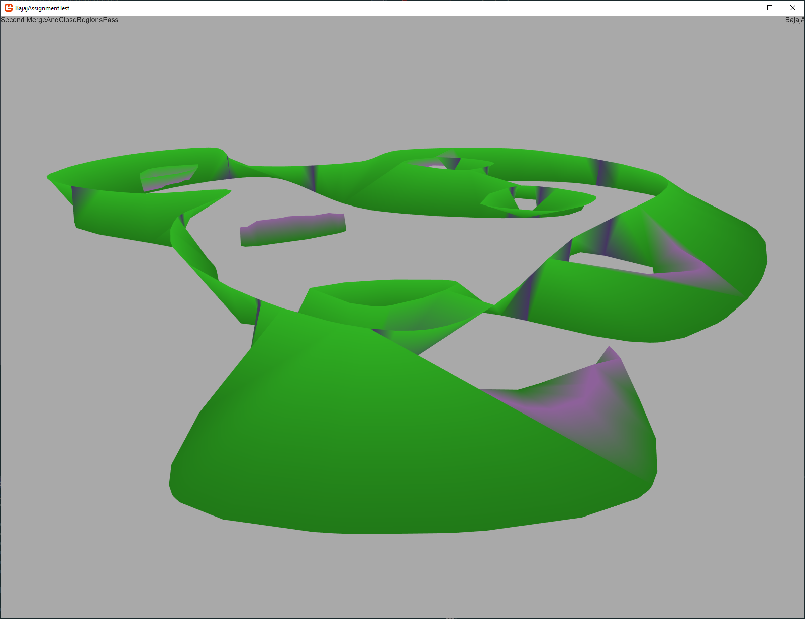

########################
Mesh Generation Overview
########################

Vikings Mesh generator is largely based on the Bajaj algorithm.  The input is a set of contours formed by taking a 2D cross-section in the XY plane through a 3D shape.  The output is a 3D manifold mesh with faces that approximate the boundary between the interior and exterior of the 3D shape.  In simpler terms it creates 3D models of cells from 2D annotations.

Mesh generation is a visual topic.  So I recommend viewing :download:`the overview movie <Bajaj2DMovie_V2_WithRegion.mp4>`

   
   The mesh for the example slice below

Loading the data
----------------

Annotations are represented in a database as a set of 2D shapes (a.k.a. "Locations" or "Annotations") with a Z coordinate.  LocationLinks indicate which shapes are connected across Z levels.  A MorphologyGraph is constructed using Viking's AnnotationVizLib library which provides an API to load the annotations from the server into a graph residing in local memory. 

Morphology and Slice Graphs
===========================

The first step in building the mesh is reorganizing the morphology graph nodes and edges into a SliceGraph.  Each SliceGraph node is composed of a set linked annotations assigned to either the "Upper" or "Lower" set.  Edges in the SliceGraph represent which slices are connected.  This allows the mesh generator to know if the slice's mesh will be composited with an adjacent slice or if the open end should be closed. 

Each SliceGraph node has a topology, which represents the shapes of the SliceNode in full details.  The mesh generator is draws heavily from the Bajaj algorithm.  One of the requirements of this generator is that everywhere a shape from the upper and lower set intersect a corresponding vertex must be added to both shapes.  However because shapes contribute to both the slice above and below the implementation uses the same shape for both nodes.  For this reason it is important to not move verticies to alter the contours of a shape because it may create or change the corresponding verticies needed for an adjacent slice.  Generation of the topology is handled by the ConcurrentTopologyInitializer class which safely parallelizes the operation. 

The Bajaj Mesh Generator
========================

With the topology constructed each slice is then passed to a BajajMeshGenerator in parallel.  The Bajaj mesh generator first adds all shape verticies to a 3D mesh, the "BajajGeneratorMesh".  Each "MorphMeshVertex" records the shape it corresponds to in the full SliceGraph and whether it is a corresponding vertex.  The mesh is also populated with all known edges.  The corresponding edges connecting verticies at the same X,Y position across Z levels and the contour edges which define the 2D shapes.

.. figure :: 00_StartingContours.png
   :alt: Contours of initial shapes.  Each edge color represents a different shape
   :align: right

   The initial contours of the shapes.  Each edge color represents a different shape.  Light brown is the sole shape in the "upper" set.  Dark brown and blue are different shapes from the "lower" set.  Not the interior hole in the light brown shape.

The verticies are then projected to XY space and triangulated.  The triangulation is then constrained using the contours of the shapes.  These new edges and faces are then added to the 3D Mesh.  All new edges are then assigned a type using spatial tests.  The assigned type indicates whether the edge would be valid or invalid if used to build a face in the final mesh.  The type enumeration indicates why or why not.  For example an edge that has a midpoint contained inside both shapes cannot be part of an exterior face of the slice and is assigned the "Internal" type.

.. figure :: 01_FirstPassTriangulationAndEdgeClassification.png
   :alt: Initial triangulation and edge type detection
   :align: right

   The classified triangulation edges added to the mesh.
   
   +-----------+-----------------------------------------------------------------------+
   |Blue       | A valid edge crossing contours.                                       |
   +-----------+-----------------------------------------------------------------------+
   |Pink       | Flying edge over open space.                                          |
   +-----------+-----------------------------------------------------------------------+
   |Light Gray | Internal edges.                                                       |
   +-----------+-----------------------------------------------------------------------+
   |Purple     | An edge crossing an interior hole                                     |
   +-----------+-----------------------------------------------------------------------+
   |Rust       | Edges internal to a shape, but possibly exposed on the outer surface. |
   +-----------+-----------------------------------------------------------------------+

Regions
_______

Using the triangulated faces we take a moment to assign subsets of faces into regions.  Regions are faces sharing an edge who have at least one invalid edge.  This will identify invaginations in shapes, unmatched interior holes, and exposed faces with no overlap to the opposite shapes.  The original intent of this code was that regions would be paired off and sent to their own mesh generator to be merged into the parent mesh.  This could ensure interior holes would remain connected even if they did not have overlap and that translations in shape position across slices would not cause "comb" like effects as exposed areas are capped instead of connected.

.. figure :: 02_FirstPassTriangulationFirstRegionClassification.png                                            
   :alt: Initial region detection image                        
   :align: right                                                 

   The first pass regions are composed of adjacent faces that have at least one valid edge and one invalid edge.

First pass face generation
__________________________

With the regions recorded all invalid edges are removed from the mesh.  A consequence of this step is the removal of all faces with one or more invalid edges as well.

+----------------------------------------------------------------------------------------------------------------+-----------------------------------------------------------------------------+
| .. figure :: Movie_V2_Frames/03.png                                                                            | .. figure :: Movie_V2_Frames/04.png                                         |
|   :alt: Initial region detection image                                                                         |    :alt: Remaining faces are valid parts of the mesh and retained           |
|                                                                                                                |                                                                             |
|   Note there are no valid edges inside any regions.                                                            |    Any remaining faces have three valid edges and are part of the final mesh|
|                                                                                                                |                                                                             |
+----------------------------------------------------------------------------------------------------------------+-----------------------------------------------------------------------------+

At this time we generate faces for all corresponding edges where possible.  In the second pass region detection we will trace edges to identify regions.  If we have a corresponding edge without faces it is considered a viable path for a region.  That case will runs into implementation details where a we have two identical points in a triangulation a possible "bowtie" configuration for the boundaries of a region.  It is simpler to add the faces now and prevent those edge cases.    

.. figure :: Movie_V2_Frames/06.png
   :alt: Faces added for corresponding verticies where possible
   :align: right
   
   For each corresponding vertex we check which two of the four possible edges between between the next/prev vertex and its corresponding next/prev vertex are be valid.  Be warned there are a number of edge cases here, and this is a prime area where incorrectly generated faces will introduce mesh features which trigger unexpected behavior later.  For example we must ensure no other verticies fall inside a face formed for the corresponding verticies.

Closing untiled regions
_______________________

The "Untiled" class of regions contains edges connecting shapes on the same plane but contained within the shape on the opposite plane.  A good example would be a branch.  To fill in these regions I followed John Edwards directions and approximate the medial axis of the region polygon.  The region shape is triangulated with the additional medial axis points and the resulting faces are added to the mesh.

.. figure :: Movie_V2_Frames/07.png
   :alt: The medial axis used to close the untiled regions
   :align: right 
   
   A view of the medial axis triangulation added to the untiled region just before the new faces are added to the final mesh.  

Slice Chords
____________

The first pass at creating SliceChords is now made.  SliceChords connect the verticies across the upper and lower set of shapes in a way such that we know the SliceChord can be on the exterior of the mesh.  We begin by creating a search tree that contains the bounding box for all of the valid face edges we identified earlier.  We then identify all incomplete verticies.  A vertex is complete if both contour edges have a face and a path exists between those faces by walking the faces of the vertex's edges.

For the incomplete verticies we determine their Optimum Tiling Vertex and store the results in the table.  The OTV is the nearest vertex on the opposite (upper/lower) side which meets a set of criteria.  For example the proposed slice-chord cannot intersect an existing slice-chord.  Multiple passes are run, each with less strict criteria.  

After each pass has identified candidates there is a resolution phase.  Candidate are sorted by length and are tested whether they still meet the criteria to be added to the mesh.  At times an earlier addition will render a slice chord invalid.  After all candidates are considered we check to see if we can create faces using the new chords and remove any complete verticies from further consideration.  If the pass added chords to the mesh it will be repeated with the same criteria.  Verticies sometimes find new valid chords with the updated information.  Once no chords are added the criteria are loosened and the next pass begins. 

For full details refer to the Bajaj paper.

.. figure :: Movie_V2_Frames/11.png
   :alt: Faces after slice chord identification
   :align: right
   
   The majority of faces are completed using the identified slice chords.  Improvements to the slice chord criteria can improve the meshes in the future. 
   
Second pass region detection
____________________________

The remaining incomplete verticies are unable to identify a slice chord on the adjacent section.  The next step is to cap off these exposed areas.  We define a second pass region by path-finding along edges to other incomplete verticies until we return to the origin.  This is done until each incomplete vertex has been assigned to a region.  

.. figure :: Movie_V2_Frames/12.png
   :alt: Second pass region detection
   :align: right
   
   The upper region is not labeled as a region.  This is because as a trivial case with only four convex verticies it has faces generated immediately.

We then run the same code used to close untiled regions identified in the first pass. 

.. figure :: Movie_V2_Frames/15.png
   :alt: Second pass region detection
   :align: right
   
   The medial axis is approximated for the region polygon.  Verticies are added and triangulated.  The resulting faces are added to the mesh.

Compositing
-----------

Each completed slice mesh must be merged into a single final mesh to represent our cell.  Since each mesh vertex recorded where in the shape it originated (the PointIndex) the identification of which verticies to merge and add is straightforward.  A trivial implementation is add each slice serially until the mesh is complete.  Unfortunately as the mesh grows larger the amount of memory to allocate and move with each added slice becomes prohibitive.  

.. figure :: RPC1_2628.png
   :alt: The final composited mesh
   :align: right
   :scale: 50 %
   
   The completed mesh of a glial cell 

To address this the MeshAssemblyPlanner class takes a SliceGraph as input and assignes each node to a leaf in a binary tree.  When a branch in the tree has all meshes generated it composites them into a single mesh.  This allows us to merge many small meshes in parallel and only at the root of the tree are a handful of large meshes merged.  The speedup was considerable.

Testing
-------

The mesh generator is a complicated piece of code.  Floating point precision issues abound and small changes can have unintended consequences.  I could not have finished it without parameter based testing practices.

The MonogameTestbed project and parameter based Geometry unit tests using FSCheck are the primary testing projects.  Geometry unit tests for Delaunay, constrained Delaunay, and polygon intersection detect issues with the core algorithms.  

Within MonogameTestbed the BajajTest has a ReproCase class and an array of previously debugged cases.  When a new case is found the location IDs should be added to the array.

BajajMultitest generates a mesh for an entire cell or a subset of a cell.  It is useful to detect bugs by building a large number of slices at once.  The debug output should contain the IDs of failed slices and red bounding boxes indicate a failed generation.  If a partial mesh is generated only the debug output will contain exceptions or information.

Future directions
-----------------

The Viking algorithm has access to more information than the Bajaj algorithm.  Namely it knows exactly which contours should be connected and which are not connected.  Unfortunately this knowledge does not extend to other corresponding features such as interior holes.  I originally intended to pair off regions so that features such as non-overlapped interior holes would be correctly represented as tunnels.

There is likely room for improvement in the Slice Chord Generator criteria as well. 