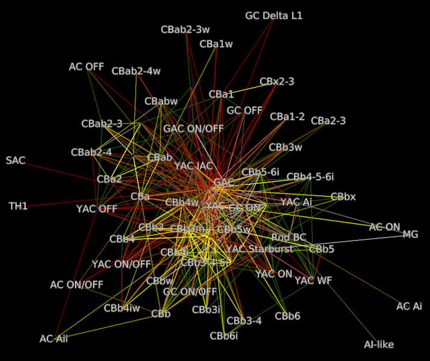
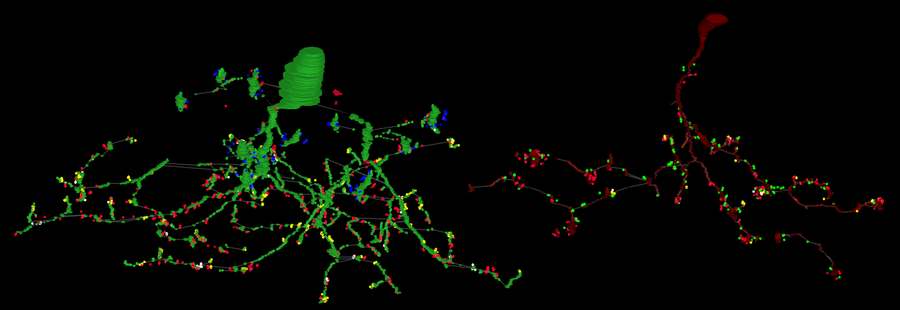

#####################
Network Visualization
#####################

The Viking web services can export files for use in external tools.  

For more technical users exporting directly using URL's is documented below 

Prerequisites
=============

  For graph visualization we recommend using `Tulip`_ and the TLP file format.  We also provide .dot files for use with `Graphviz`_.

Tulip Analysis Plugin
---------------------

   Ethan Kerzner has developed `TulipPaths`_ a set of useful plugins for analyzing graphs in Tulip.
    

Export from the web page
========================

  This user friendlier `website`_ exports files for Marc lab hosted databases.  

Export directly from a URL
==========================

  Exports are available under a volume URL's /export/ subpath.  An Export URL has the following components

.. http:get:: /export/( report_type )/( format )/
    
   
Neuron connectivity network
===========================

  Neuronal connectivity graphs map nodes to individual neurons (parent structures).  Edges are the collection of all connections between neurons grouped by type.  

.. http:get:: /export/network/( Format )

   Requests the connectivity graph for the neurons specified in the query string.
      
   **Format:**
      * **TLP** - Tulip file format
      * **DOT** - Graphviz DOT file format
      * **GraphML** - GraphML file format
      * **JSON** - Java script object notation
        
   :query id: ID numbers of cells to include in connectivity graph.  Commas separate multiple IDs.
   :query hops: Degrees of seperation to include additional neurons in graph
   
   :resheader Content-Type: text/plain
   
   **Example request**
      
      Get all cells within one degree of seperation of cells 476 and 514.
      
      .. sourcecode:: http
      
         http://websvc1.connectomes.utah.edu/RC1/export/network/tlp?id=476,514&hops=1
         
      Get all cells in the network:
      
      .. sourcecode:: http
      
         http://websvc1.connectomes.utah.edu/RC1/export/network/tlp
         
   **Neuron Node Properties:**
   
	* **Area** - Surface area in square nm
	* **MinZ** - Mininum section number the structure occurs upon
	* **MaxZ** - Maximum section number the structure occurs upon
	* **MaxDimension** - Dimension of the annotations used to markup the structure.  1 for line annotations, 2 for circles/polygons
	* **StructureURL** - Link to structure in OData server
	* **Tags** - Tags users have added to the structure
	* **Volume** - Volume of the structure in cubic nm
		
   **Neuron Edge Properties:**
   
	* **Directional** - True if the connection is a one-way path, i.e. synapses.  False if the connection is two way, i.e. gap junctions.
	* **EdgeType** - The type of connection, synapse, ribbon, gap junction, etc...
	* **IsLoop** - True if the edge connects between two annotations on the same structure.
	* **LinkedStructures** - A list of the child structures linked in the database that define this edge.
	* **MinZ** - Mininum section number an instance of this edge occurs upon.
	* **MaxZ** - Maximum section number an instance of this edge occurs upon.
	* **TotalSourceArea** - Total surface area of the source side of all linked source structures, i.e. Total area of all membrane patches.
	* **TotalTargetArea** - Total surface ara of the target side of all linked target structures, i.e. Total area of post-synaptic densities.
		   
.. figure::  Network_2014_11_25.png   

Motif connectivity
==================

  Motif connectivity graphs group all neurons (Structures) by label and map each label to a node.  Edges are the collection of all connections between those labels grouped by type.

.. http:get:: /export/motif/( Format )

   Connectivity between classes of neurons based on label.  Includes all neurons.  Nodes represent the set of all structures that share a label.  Edges indicate at least one connection between cells with those labels.
   
   **Format:**
      * **TLP** - Tulip file format
      * **DOT** - Graphviz DOT file format
      * **GraphML** - GraphML file format
      * **JSON** - Java script object notation
     
   :resheader Content-Type: text/plain
   
   **Example request**
   
      Get a dot file of the morphology for use in Graphviz
      
      .. sourcecode:: http   
         
         http://websvc1.connectomes.utah.edu/RC1/export/motifs/dot
         
   **Motif Node Properties:**
   
		* **NumberOfCells** - Total number of cells with this label that have an edge in the database
		* **InputTypeCount** - Total distinct types of inputs, i.e. { CB1 -> X, CB2 -> X} X has 2 Input types
		* **OutputTypeCount** - Total distinct types of outputs, i.e {X => CB1, X=> CB2, X => CB3} X has 3 output types
		* **BidirectionTypeCount** - Total distinct types of bidirectional outputs, i.e { X <=> A2} X has 1 bidirectional output type
		* **StructureIDs** - A list of StructureIDs that share this label
		* **StructureURL** - A URL to load the structure from the ODATA server
		* **MorphologyURL** - A URL to load morphology for cells with this label
		
   **Motif Edge Properties:**
   
   		* **EdgeType** - The type of connection, synapse, ribbon, gap junction, etc...
		* **SourceParentStructures** - The parent structures of the edges source structures. i.e, the cell that contains the synapse
		* **TargetParentStructures** - The parent structures of the edges target structures. i.e, the cell that contains the post-synaptic density
		* **ConnectionSourceStructures** - The structures that are sources of the edge, i.e. The synapses
		* **ConnectionTargetStructures** - The structures that are targets of the edge, i.e. The post-synaptic density
		* **%OccurenceInSourceCells** - How many of the source node's cells originate this connection
		* **%OccurenceInTargetCells** - How many of the target node's cells receive this connection
		* **%ofSourceTypeOutput** - How much of the total output of the source node does this edge represent
		* **%ofTargetTypeInput** - How much of the total input of the target node does this edge represent
		* **%ofSourceTypeBidirectional** - How much of the bidirectional connections to the source node does this edge represent 
		* **%ofTargetTypeBidirectional** - How much of the bidirectional connections to the target node does this edge represent
		* **Avg#OfOutputsPerSource** - Average number of outgoing connections an individual cell makes to the target type
		* **Avg#OfInputsPerTarget** - Average number of incoming connections an individual cell receives from the source type
		* **StdDevOfOutputsPerSource** - The standard deviation of outgoing connections an individual cell makes to the target type
		* **StdDevOfInputsPerTarget** - The standard deviation of incoming connections an individual cell receives from the source type
		

		 

Morphology
==========
  
   Morphology graphs map each annotation to a node.  Edges represent links between annotations.  The position information is preserved to create a 3D model of the structures.

.. http:get:: /export/morphology/( Format )

   Returns a 3D graph using annotations to determine node position.
   
   Nodes with a glowing effect are involved in a structure link.
   
   **Format:**
      * **TLP** - Tulip file format
      * **JSON** - Java script object notation
     
   :query id: ID numbers of cells to include in connectivity graph.  Commas separate multiple IDs.
   :query stick: When set to a number greater than 0 the morphology graph is simplified.  Only nodes representing process terminations or branching points are represented.
   
   :resheader Content-Type: text/plain
   
   **Example request**
   
      Get the morphology of cells 180 and 476.
      
      .. sourcecode:: http
      
         http://websvc1.connectomes.utah.edu/RC1/export/morphology/tlp?id=180,476
         

      

      
Navigation between Viking and Tulip
-----------------------------------

    * Tulip to Viking: Morphology nodes in Tulip contain a **LocationInViking** column.  The contents of that column can be copied into the clip board.  Then in Viking use CTRL+G and paste the coordinates to jump to that location
    * Viking to Tulip: The context menus for annotations in Viking contain a **Copy Location ID** column.  Selecting that option puts the ID into the clipboard.  Then switch to Tulip and use the ID value to search the **LocationID** column of all nodes.  The resulting node matches the annotation in Viking.
         
         Viking **Copy Location ID** context menu
         
         .. figure:: TulipLocationIDSearch0.png
            
         Tulip search UI
         
         .. figure:: TulipLocationIDSearch.png
         
.. _Tulip: http://tulip.labri.fr/
.. _Graphviz: http://www.graphviz.org/
.. _website: http://websvc1.connectomes.utah.edu/Export
.. _TulipPaths: https://github.com/visdesignlab/TulipPaths