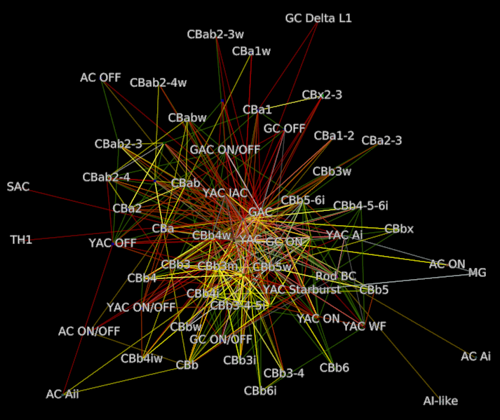
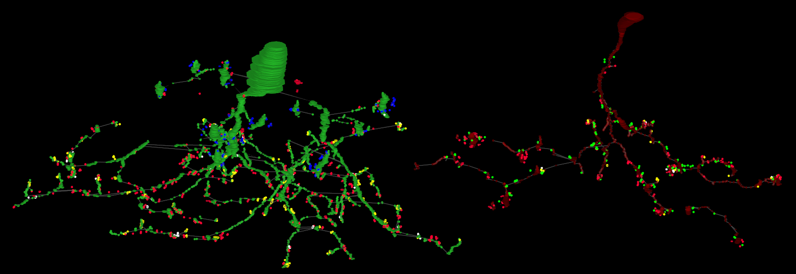

#####################
Network Visualization
#####################

The Viking web services can export files for use in external tools.  

For more technical users exporting directly using URL's is documented below 

Prerequisites
=============

  For graph visualization we recommend using `Tulip`_ and the TLP file format.  We also provide .dot files for use with `Graphviz`_.

Tulip Analysis Plugin
---------------------

   Ethan Kerzner has developed `TulipPaths`_ a set of useful plugins for analyzing graphs in Tulip.
    

Export from the web page
========================

  The `export portal`_ builds these URLs for you.  Choose a volume, an export type and a
  format, paste or drag-drop a list of structures, and it assembles the request and
  downloads the result.  It covers every export described below and is the recommended
  starting point.

  The portal accepts three kinds of entry, which may be mixed freely in one list:

  ==========  =====================  ================================================
  Entry       Example                Meaning
  ==========  =====================  ================================================
  ID          ``180``                A single structure.
  Range       ``1-10``               Every ID from 1 to 10, inclusive of both ends.
  Label       ``CBb3n``              Every structure whose label contains that text,
                                     ignoring case.
  ==========  =====================  ================================================

  **Separate entries with a comma, a semicolon, or a new line.**  Whitespace separates
  numbers only.  That distinction exists because labels contain spaces: on RC1, 313 of the
  8,044 labelled structures have one, including ``GC ON`` and ``yAC ON+OFF``.  Splitting
  those on whitespace would search for fragments instead of the label.  A range must have
  digits on both sides, which is what keeps a hyphenated label such as ``CBa2-3`` from
  being read as a range.

  Labels are resolved by the portal, which looks up matching structures in the volume's
  OData service and puts the resulting IDs into the URL.  It reports what each label
  matched, and it will not start a download when nothing in the box matched anything,
  because an export with no IDs means the whole volume.

.. note::

   Ranges and labels are conveniences of the portal, not of the export service.  By the
   time a request reaches the service it carries plain numeric IDs.  A URL written by hand
   must therefore use IDs only, as described below.

Export directly from a URL
==========================

  Exports live under a volume's ``/Export/`` subpath.  An export URL has three parts after
  the volume: the report, the format, and a query string.

.. http:get:: /( volume )/Export/( report )/( format )

   A mistyped URL does not return 404.  The service answers **HTTP 200 with this
   documentation page**, so a bad URL looks like a successful request that produced
   unexpected content.  Check the response body if an export seems to return the wrong
   thing.

   Paths are not case sensitive, so ``dot`` and ``DOT`` are equivalent.

   Not every report offers every format:

   ===========  ===  ====  ===  ===
   Report       TLP  JSON  DOT  GML
   ===========  ===  ====  ===  ===
   Morphology   yes  yes   no   no
   Network      yes  yes   yes  yes
   Motif        yes  yes   yes  no
   ===========  ===  ====  ===  ===

.. note::

   Until August 2026 the format had to be named twice, as
   ``/( volume )/Export/( report )/Get( FORMAT )/( format )``.  That form still works, so
   existing links and scripts need no changes, but the shorter URL above is preferred for
   new work.

.. warning::

   Multiple IDs are separated by **semicolons**, not commas.  A comma-separated list is
   not rejected; it silently yields a near-empty file.  Because a semicolon terminates a
   query string in some shells, quote the URL when using tools such as ``curl``.

   The service accepts **numeric IDs only**.  Ranges and labels are portal features and
   mean nothing here: ``?ids=1-10`` and ``?ids=CBb3n`` are both discarded, and because an
   empty ID set means "export the whole volume", either one quietly returns the entire
   volume rather than an error.  The service splits on semicolons and newlines, so a
   multi-line value works, but a comma does not.

Neuron connectivity network
===========================

  Neuronal connectivity graphs map nodes to individual neurons (parent structures).  Edges are the collection of all connections between neurons grouped by type.  

.. http:get:: /( volume )/Export/Network/( format )

   Requests the connectivity graph for the neurons specified in the query string.
      
   **Format:**
      * **TLP** - Tulip file format, ``tlp``
      * **DOT** - Graphviz DOT file format, ``dot``
      * **GML** - GraphML file format, ``gml``
      * **JSON** - Java script object notation, ``json``
        
   :query ids: ID numbers of cells to include in connectivity graph.  Semicolons separate multiple IDs.  Omit to export the whole volume.
   :query hops: Degrees of seperation to include additional neurons in graph
   
   :resheader Content-Type: text/plain
   
   **Example request**
      
      Get all cells within one degree of seperation of cells 476 and 514.
      
      .. code-block:: text
      
         https://websvc.codepharm.net/RC1/Export/Network/tlp?ids=476;514&hops=1
         
      Get all cells in the network:
      
      .. code-block:: text
      
         https://websvc.codepharm.net/RC1/Export/Network/tlp
         
      Raising ``hops`` grows the result quickly.  For RC1 cell 180 the DOT export is
      roughly 0.9 MB at one hop and 39 MB at three.
         
   **Neuron Node Properties:**
   
	* **Area** - Surface area in square nm
	* **MinZ** - Mininum section number the structure occurs upon
	* **MaxZ** - Maximum section number the structure occurs upon
	* **MaxDimension** - Dimension of the annotations used to markup the structure.  1 for line annotations, 2 for circles/polygons
	* **StructureURL** - Link to structure in OData server
	* **Tags** - Tags users have added to the structure
	* **Volume** - Volume of the structure in cubic nm
		
   **Neuron Edge Properties:**
   
	* **Directional** - True if the connection is a one-way path, i.e. synapses.  False if the connection is two way, i.e. gap junctions.
	* **EdgeType** - The type of connection, synapse, ribbon, gap junction, etc...
	* **IsLoop** - True if the edge connects between two annotations on the same structure.
	* **LinkedStructures** - A list of the child structures linked in the database that define this edge.
	* **MinZ** - Mininum section number an instance of this edge occurs upon.
	* **MaxZ** - Maximum section number an instance of this edge occurs upon.
	* **TotalSourceArea** - Total surface area of the source side of all linked source structures, i.e. Total area of all membrane patches.
	* **TotalTargetArea** - Total surface ara of the target side of all linked target structures, i.e. Total area of post-synaptic densities.
		   
.. figure::  Network_2014_11_25.png   

Motif connectivity
==================

  Motif connectivity graphs group all neurons (Structures) by label and map each label to a node.  Edges are the collection of all connections between those labels grouped by type.

.. http:get:: /( volume )/Export/Motif/( format )

   Connectivity between classes of neurons based on label.  Includes all neurons.  Nodes represent the set of all structures that share a label.  Edges indicate at least one connection between cells with those labels.
   
   The report always covers the entire volume, so it takes no query parameters.
   
   **Format:**
      * **TLP** - Tulip file format, ``tlp``
      * **DOT** - Graphviz DOT file format, ``dot``
      * **JSON** - Java script object notation, ``json``
     
   :resheader Content-Type: text/plain
   
   **Example request**
   
      Get a dot file of the motif connectivity for use in Graphviz
      
      .. code-block:: text   
         
         https://websvc.codepharm.net/RC1/Export/Motif/dot
         
      Because the report covers the whole volume its cost scales with volume size.
      Smaller volumes return in seconds, RC2 takes roughly two minutes, and RC1 can
      take longer still.  Allow a generous timeout rather than assuming the request
      has failed.
         
   **Motif Node Properties:**
   
		* **NumberOfCells** - Total number of cells with this label that have an edge in the database
		* **InputTypeCount** - Total distinct types of inputs, i.e. { CB1 -> X, CB2 -> X} X has 2 Input types
		* **OutputTypeCount** - Total distinct types of outputs, i.e {X => CB1, X=> CB2, X => CB3} X has 3 output types
		* **BidirectionTypeCount** - Total distinct types of bidirectional outputs, i.e { X <=> A2} X has 1 bidirectional output type
		* **StructureIDs** - A list of StructureIDs that share this label
		* **StructureURL** - A URL to load the structure from the ODATA server
		* **MorphologyURL** - A URL to load morphology for cells with this label
		
   **Motif Edge Properties:**
   
   		* **EdgeType** - The type of connection, synapse, ribbon, gap junction, etc...
		* **SourceParentStructures** - The parent structures of the edges source structures. i.e, the cell that contains the synapse
		* **TargetParentStructures** - The parent structures of the edges target structures. i.e, the cell that contains the post-synaptic density
		* **ConnectionSourceStructures** - The structures that are sources of the edge, i.e. The synapses
		* **ConnectionTargetStructures** - The structures that are targets of the edge, i.e. The post-synaptic density
		* **%OccurenceInSourceCells** - How many of the source node's cells originate this connection
		* **%OccurenceInTargetCells** - How many of the target node's cells receive this connection
		* **%ofSourceTypeOutput** - How much of the total output of the source node does this edge represent
		* **%ofTargetTypeInput** - How much of the total input of the target node does this edge represent
		* **%ofSourceTypeBidirectional** - How much of the bidirectional connections to the source node does this edge represent 
		* **%ofTargetTypeBidirectional** - How much of the bidirectional connections to the target node does this edge represent
		* **Avg#OfOutputsPerSource** - Average number of outgoing connections an individual cell makes to the target type
		* **Avg#OfInputsPerTarget** - Average number of incoming connections an individual cell receives from the source type
		* **StdDevOfOutputsPerSource** - The standard deviation of outgoing connections an individual cell makes to the target type
		* **StdDevOfInputsPerTarget** - The standard deviation of incoming connections an individual cell receives from the source type
		

		 

Morphology
==========
  
   Morphology graphs map each annotation to a node.  Edges represent links between annotations.  The position information is preserved to create a 3D model of the structures.

.. http:get:: /( volume )/Export/Morphology/( format )

   Returns a 3D graph using annotations to determine node position.
   
   Nodes with a glowing effect are involved in a structure link.
   
   **Format:**
      * **TLP** - Tulip file format, ``tlp``
      * **JSON** - Java script object notation, ``json``
     
   :query ids: ID numbers of cells to include in the graph.  Semicolons separate multiple IDs.
   :query stick: When set to a number greater than 0 the morphology graph is simplified.  Only nodes representing process terminations or branching points are represented.
   
   :resheader Content-Type: text/plain
   
   **Example request**
   
      Get the morphology of cells 180 and 476.
      
      .. code-block:: text
      
         https://websvc.codepharm.net/RC1/Export/Morphology/tlp?ids=180;476
         
      Simplify the same cells to their branch and termination points.
      
      .. code-block:: text
      
         https://websvc.codepharm.net/RC1/Export/Morphology/tlp?ids=180;476&stick=1
         
.. note::

   Morphology **JSON** currently returns an empty envelope of the form
   ``{"Morphology":[{}]}`` on every volume, one empty object per requested structure.
   Use the TLP format until this is fixed.
         

      

      
Navigation between Viking and Tulip
-----------------------------------

    * Tulip to Viking: Morphology nodes in Tulip contain a **LocationInViking** column.  The contents of that column can be copied into the clip board.  Then in Viking use CTRL+G and paste the coordinates to jump to that location
    * Viking to Tulip: The context menus for annotations in Viking contain a **Copy Location ID** column.  Selecting that option puts the ID into the clipboard.  Then switch to Tulip and use the ID value to search the **LocationID** column of all nodes.  The resulting node matches the annotation in Viking.
         
         Viking **Copy Location ID** context menu
         
         .. figure:: TulipLocationIDSearch0.png
            
         Tulip search UI
         
         .. figure:: TulipLocationIDSearch.png
         
.. _Tulip: http://tulip.labri.fr/
.. _Graphviz: http://www.graphviz.org/
.. _export portal: https://websvc.codepharm.net/Export/
.. _TulipPaths: https://github.com/visdesignlab/TulipPaths