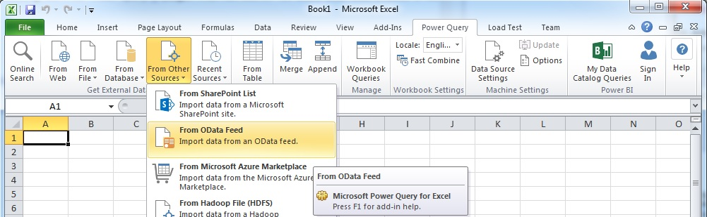
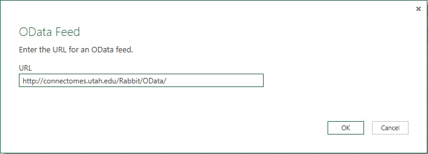

#############
OData Service
#############

`OData`_ is an open consistent method for querying data over the web.  Viking volumes suppport a read-only OData 4.0 interface under the http://<Volume>/OData/ path.  

For example, the RC1 OData service is available here:
   http://websvc1.connectomes.utah.edu/RC1/OData/
    
The power of OData is allowing external clients to access annotations over the web.  OData can export either `JSON`_ or `ATOM`_ formats.  Below are examples of using OData.

Excel
-----

To use OData from Excel begin by installing the free `Power Query`_ plugin from Microsoft.  Import OData by using the Power Query tab this adds to Excel:

Enter the OData URL into the prompt provided by Excel:

This provides access to the raw annotation data from the database. 

Python
------

It is also easy to access data from Python scripts.  I have begun a `connectome analysis package`_ which uses the OData service from Python to run some common queries and build datastructures.
I plan to polish the connectome analysis package when time permits and complete the `documentation`_.  Feel free to contact the Marc Lab if you need assistance sooner.

The connectome analysis package also contains unit tests and examples which are instructive for how to access OData from Python:

   The jsonwebclient sub-package converts OData JSON responses into Python objects
   https://github.com/jamesra/py-connectome-analysis/tree/master/connectome_analysis/webclient

   Unit tests which perform simple queries 
   https://github.com/jamesra/py-connectome-analysis/blob/master/test/test_jsonwebclient/test_jsonwebclient.py

   Exporting SWC files for use in NEURON using the large connectomics analysis package.
   https://github.com/jamesra/py-connectome-analysis/blob/master/examples/CreateSWC.py
 

.. _ATOM: http://www.atomenabled.org/
.. _connectome analysis package: https://github.com/jamesra/py-connectome-analysis
.. _documentation: https://github.com/jamesra/py-connectome-analysis/wiki  
.. _JSON: http://www.json.org/
.. _OData: http://www.odata.org/
.. _Power Query: http://www.microsoft.com/en-us/download/details.aspx?id=39379