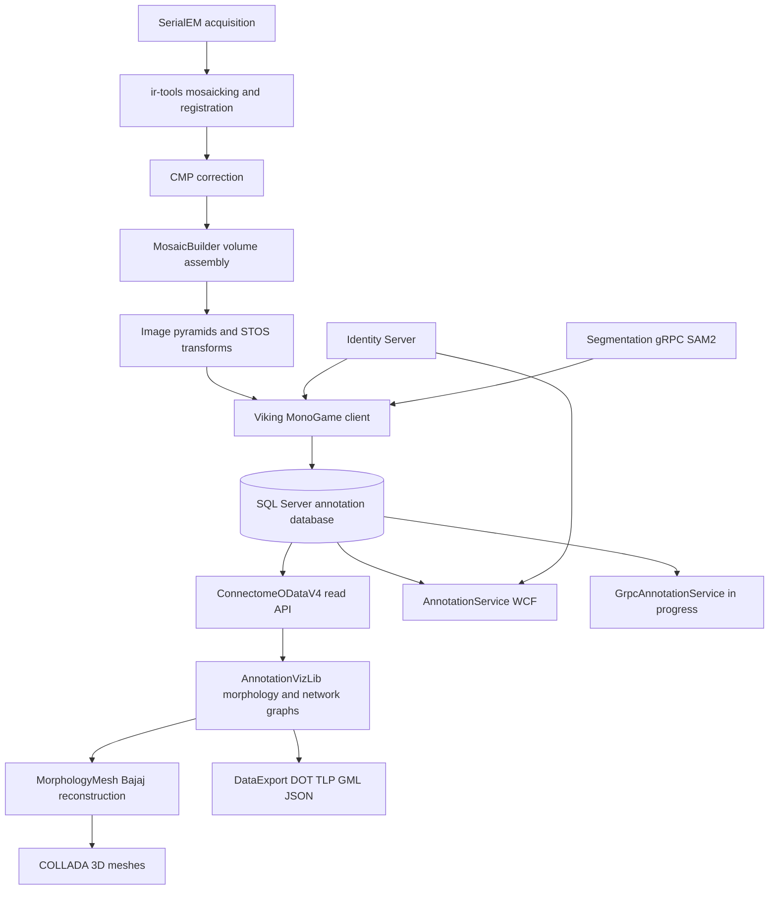

# Viking Methods Paper -- Detailed Outline

Working title: *Viking: A Modern Platform for Ultrastructural Connectome Mapping
and Analysis*

This outline expands the 2009 framework paper (Anderson et al., "A Computational
Framework for Ultrastructural Mapping of Neural Circuitry", PLoS Biology 2009)
to cover the substantial work done on Viking since publication. It is written for
a connectomics / EM reconstruction methods audience. The companion fact sheet on
spatial database columns is in
[`spatial-columns-factsheet.md`](spatial-columns-factsheet.md); the full prose
draft is in [`viking-methods-paper.md`](viking-methods-paper.md).

## How this maps to the 2009 paper

| 2009 paper section | Status today | New paper coverage |
|--------------------|--------------|--------------------|
| Image acquisition (SerialEM) | Largely unchanged | Brief recap, cite original |
| Mosaicking and registration (ir-tools, CMP) | Largely unchanged | Brief recap; STOS transform model in client |
| MosaicBuilder / volume assembly | Evolved | Volume pyramids, transform composition |
| Viking client (Win32 multislice pager) | Replaced | MonoGame/XNA client, dual coordinate spaces |
| Annotation workflow (12 steps) | Expanded | Structure/location model, region loading, links |
| Data storage | Barely described | SQL Server schema, spatial geometry, CDC |
| Programmatic access | Not present | OData API, gRPC migration, Export service |
| Authentication | Not present | Identity Server, volume-scoped rights |
| 3D morphology | Not present | AnnotationVizLib graphs, Bajaj mesh, COLLADA |
| Deployment | Lab servers | Docker compose, mounted-config convention |

## Architecture at a glance

## Section-by-section outline

### 1. Abstract
- Same scientific goal as 2009: terabyte-scale EM volumes traced into validated
  neural circuits.
- New emphases: collaborative web-scale annotation, a spatially indexed
  database, programmatic analysis APIs, and an automated 2D-to-3D morphology
  reconstruction pipeline.

### 2. Introduction
- Recap the 2009 framework and the problem it solved.
- Motivate the changes: larger volumes, more annotators, demand for quantitative
  3D morphology and network analysis, and security for multi-institution access.
- State scope: this paper documents the platform as it exists now.

### 3. Image volume pipeline (brief recap plus what changed)
- Acquisition and mosaicking unchanged; cite 2009.
- Volume model in code: `Volume`, `Section`, `Pyramid`, `TilePyramid`
  ([`Clients/VolumeModel/`](../../../Clients/VolumeModel/)).
- Two tile-mapping strategies: `FixedTileCountMapping` (classic EM mosaics) and
  `TileGridMapping` (pre-tiled / OCP pyramids).
- HTTP tile serving and the local disk/in-memory tile cache (`TileCache`,
  `TextureReaderV2`).

### 4. Coordinate spaces and registration
- Mosaic/section space versus volume space; see
  [`.cursor/rules/coordinate-spaces.mdc`](../../../.cursor/rules/coordinate-spaces.mdc).
- STOS transform types: `GridTransform`, `MeshTransform`, `RigidTransform`,
  `RBFTransform`, `TriangulationTransform`
  ([`Geometry/Transforms/`](../../../Geometry/Transforms/)).
- Pairwise to global registration via `RegistrationTree` and
  `Volume.CreateVolumeTransforms`.
- Runtime conversion: `IVolumeToSectionTransform` (`SectionToVolume` /
  `VolumeToSection`).
- The JSON transform cache (`JsonTransformSerializer`, `FixedTileCountMapping`)
  and the 2026 polymorphic deserializer fix.

### 5. Annotation data model
- Core entities: `Structure`, `Location`, `StructureLink`, `LocationLink`
  ([`Servers/ConnectomeDataModelCore/`](../../../Servers/ConnectomeDataModelCore/),
  client mirror in [`Clients/WebAnnotationModel/`](../../../Clients/WebAnnotationModel/)).
- Biological mapping: structures are cells/processes/organelles/synapses;
  locations are per-section footprints; structure links are connectivity edges;
  location links are tracing continuity.
- Structure types, markup types (point/line/poly), permitted link types, and
  parent/child hierarchies (`PermittedStructureLinkObj`, `StructureTypeObj`).
- Spatial geometry columns (`MosaicShape`, `VolumeShape`) and the August 2015
  migration; schema versioning via the `DBVersion` table (currently 83).
- Change Data Capture and the bounds stored procedures (e.g.
  `SelectSectionLocationsAndLinksInMosaicBounds`).

### 6. Viking client architecture
- MonoGame/XNA rendering stack
  ([`Clients/MonogameXNAGraphicsShared/`](../../../Clients/MonogameXNAGraphicsShared/)).
- Multislice navigation: `SectionViewerControl`, step/zoom controls, reference
  sections above/below.
- Region-based annotation loading: `RegionLoader`, viewport-to-mosaic bounds,
  spatial query per grid cell, in-memory R-tree.
- Rendering annotations: `AnnotationOverlay`, on-section and adjacent-section
  views, location links and structure links, label rendering.

### 7. Server infrastructure and APIs
- WCF `AnnotationService` (`AnnotateService`, role-based: Read/Write/Annotate/
  Review/Modify).
- gRPC replacement in progress (`GrpcAnnotationService`, protos under
  [`gRPCAnnotationServiceTypes/Protos/`](../../../gRPCAnnotationServiceTypes/Protos/)).
- OData v4 read API (`Servers/ConnectomeODataV4/`): entity sets and network
  functions (`Network`, `NetworkLinks`, `Scale`).
- Export service (`Servers/DataExport/`): DOT, TLP, GML, JSON for graphs.
- Identity Server: volume-scoped claims (`{VolumeName}.{permission}`), JWT
  validation in `JwtMessageInspector`.
- Docker deployment: combined Windows/IIS image and the
  `D:\Docker\mounted-configs\<ServiceName>` convention.

### 8. Segmentation and assisted tracing
- Segmentation gRPC service and SAM2 integration
  ([`gRPC_Protos/Segmentation/SAM2/segmentation.proto`](../../../gRPC_Protos/Segmentation/SAM2/segmentation.proto)).
- How assisted polygons fit the annotation workflow (high level).

### 9. 3D morphology and connectome analysis
- Building graphs from annotations: `MorphologyGraph` (nodes = locations, edges =
  location links) and `NeuronGraph` (structure-level connectivity).
- Three client backends: `ODataMorphologyFactory`, `WCFMorphologyFactory`,
  `SimpleODataMorphologyFactory`.
- Mesh reconstruction: `SliceGraph` to `BajajMeshGenerator` (constrained
  Delaunay, optimal tiling vertices, slice chords) to `MorphologyColladaView`
  ([`MorphologyMesh/`](../../../MorphologyMesh/)).
- Output formats and how they feed downstream analysis (the colleague's 3D
  connectome methods).

### 10. Quality control, performance, and scale
- VikingAU automated position adjustment
  ([`Clients/VikingAU/`](../../../Clients/VikingAU/)).
- Spatial indexes and bounds queries; tile and transform caches; query-date
  consistency for multi-user editing.
- Terabyte-scale considerations (update figures if newer volumes exist).

### 11. Discussion
- Comparison table (2009 versus current).
- Limitations and ongoing work (gRPC cutover, mesh export wiring).

### 12. Availability
- Repositories, server deployment, and data access.

## Figures to produce

- Figure 1: Updated end-to-end workflow (extends 2009 Figure 3).
- Figure 2: Mosaic versus volume coordinate spaces with one structure traced
  across sections.
- Figure 3: Client/server/data-flow architecture.
- Figure 4: Region-based spatial loading concept.
- Figure 5: 2D annotations to 3D Bajaj mesh pipeline.

## Source files to mine for the full draft

- Database: [`Servers/SQL/DatabaseCreateUpdate/CreateUpdateDatabase.sql`](../../../Servers/SQL/DatabaseCreateUpdate/CreateUpdateDatabase.sql)
- Volume model: [`Clients/VolumeModel/`](../../../Clients/VolumeModel/),
  [`Geometry/Transforms/`](../../../Geometry/Transforms/)
- Client annotation: [`Clients/Viking/WebAnnotation/`](../../../Clients/Viking/WebAnnotation/),
  [`Clients/WebAnnotationModel/`](../../../Clients/WebAnnotationModel/)
- Morphology and mesh: [`AnnotationVizLib/`](../../../AnnotationVizLib/),
  [`MorphologyMesh/`](../../../MorphologyMesh/)
- Servers: [`Servers/ConnectomeODataV4/`](../../../Servers/ConnectomeODataV4/),
  [`Servers/DataExport/`](../../../Servers/DataExport/),
  [`Servers/AnnotationService/`](../../../Servers/AnnotationService/),
  [`Servers/GrpcAnnotationService/`](../../../Servers/GrpcAnnotationService/)
