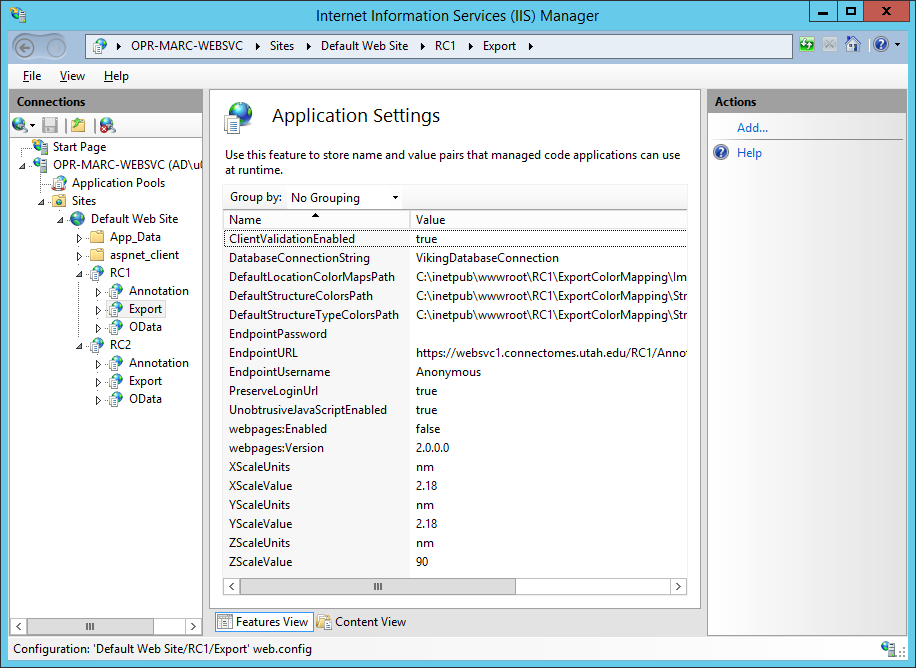

############
Web Services
############

Overview
========

.. image:: ../Architecture.png

Installing the web services requires IIS.  This will document how we configure web services for two volumes **RC1** and **RC2**.

Initial IIS configuration
=========================

IIS must be installed on the machine with WCF and .NET 4.0 support.  :download:`Screenshot of our IIS installed roles. <IISServerConfig.png>`

Either generate a local SSL certificate or obtain an official one.  Viking's annotation service refers to the certificate by serial number in a later configuration step.  The serial number can be found on by viewing the installed certificate.

.. image:: IISSSLCert.png

Web Service Deployment Procedure
================================

Load the Server component solution in Visual Studio.  Open the web.config file of the AnnotationService project.  Update the serviceCertificate node's findvalue attribute to match the serial number of the certificate you will be using.

   ::
   
   <serviceCertificate findValue ="00f19cb44c6565392ba1cda8423adfcf25" storeLocation ="LocalMachine" x509FindType="FindBySerialNumber"/>
                       
This step is only required if you will be writing to your own annotation web service.  The OData and Export projects can be configured to point at an existing web service.
                       
After getting the Server components solution to build these projects should be published to the deployment directory:
   * **Annotation Service** This project has to be manually built as both Release and Debug and deployed to the relevant diretory.
   * **ConnectomeOpenData** Publish both the Production and Test configuration
   * **DataExport** Publish both the Production and Test configuration

We prefer to upgrade all of our services with a single copy.  To accomplish this we copy the deployment directory to a folder outside of IIS.  The volumes in IIS will all point to this directory as a virtual directory.  When we update the binaries here all volumes will be upgraded.

.. image:: WebServiceApplicationFolders.png

Volume deployment procedure
===========================

Explorer
--------

Each volume gets its own application within IIS.  We create a folder for the volume under the root website. 

.. image:: WebServiceFolders.png

Note the ExportColorMapping folder under RC1 which will contain the default color mappings used by the file exporter web service.

There is a default web.config file which arrived with the deployment directory.  This file contains the default values for all of the application settings.  
Copy this folder to the root of your new volume directory.  In this example it would be copied to C:\inetpub\wwwroot\RC1\web.config.  These settings will be updated in a later step.

IIS
---

Create an application pool for the volume
_________________________________________

Below shows the application pool for the volume.  If the database is on a remote machine you will need to create an active directory account for the application identity.  If the database is local the application's identity is sufficient.

The application pool must be configured to use .NET 4.  It is possible to share the application pool across multiple volumes.  In our production server we assign a separate application pool to the annotation service which has write permissions to the database.

.. image:: IISVolumeApplicationPoolConfig.png

Configure the volume application
________________________________

#. Open IIS manager and open the website containing the folders you created above.  If they appear to be normal
   folders right-click the folder and choose "Convert to Application".  Assign the application to the .NET 4.0
   application pool you have created.
#. Create a database connection string, *VikingApplicationServices*, for your membership and roles database.
   The default web.config for a Viking volume expects this connection string to be configured.  This database
   must be an ASP.NET SQL roles provider database.
#. Create a database connection string, *VikingDatabaseConnection*, for your annotation database.  The default
   web.config for a Viking volume expects this connection string to be configured.

Create virtual applications for each web service
________________________________________________

For each web service add a new application to the volume application.

The standard application names for each C# project:
   * **Annotation Service** → Annotation
   * **ConnectomeOpenData** → OData
   * **DataExport** → Export
   * Append "Test" to the above names when pointing to debug binaries, ex: *ODataTest*
  
In the image below we are adding an ExportTest application to the RC1 volume.

.. image:: IISCreateApplication.png

Application settings
____________________

Open the application settings for the volume application. 

These settings will be inherited by the child applications unless overridden, so we configure at the root application level.

**Shared**
   :DatabaseConnectionString: Annotation and OData service. The IIS connection string to use when talking directly to the annotation database.  *VikingDatabaseConnection* by default.
   
**Export**
   :DefaultLocationColorMapsPath: Default configuration file to map location positions to colors.
   :DefaultStructureColorsPath: Default configuration file to map strcture IDs to colors.
   :DefaultStructureTypeColorsPath: Default configuration file to map structure type IDs to colors.
   :EndpoingURL: URL of annotation service to use when exporting data.
   :EndpointUsername: Username to use for annotation service endpoint, should be a user with read-only access, we use *anonymous*.
   :EndpointPassword: Password to use for annotation service endpoint.
   :(X/Y/Z)ScaleUnits: Pixel to measurement unit mapping.
   :(X/Y/Z)ScaleValue: Units of measure for pixel scale, defaults to *nm*.
   
The configuration of the web services should be complete.  Please let us know if these instructions are missing any steps.